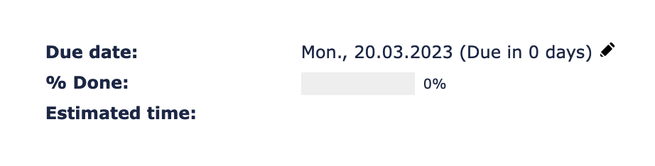
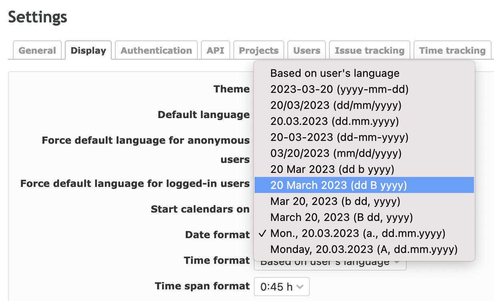

# Redmine Add Date Formats with Day Names

## Overview

Redmine plugin. Adds date formats with day names to [Redmine](http://www.redmine.org/) settings:

## Introduction

[Redmine](http://www.redmine.org) with its functionality offers almost everything you need, we just had to extend the functionality for our internal needs, and this plugin was the result.

## Features

Basically adds these two options which are configurable via settings.

- %a., %d.%m.%Y
- %A, %d.%m.%Y

## Installation

To install the plugin, either clone it or download it and  xtract the directory into ur plugins directory in your redmine dir.

    git clone github.com/ablidadev/redmine_add_date_formats_with_day_names.git
    move redmine_add_date_formats_with_day_names into redmine/plugins/.

More information on installing Redmine plugins can be found here: [Redmine Plugins](http://www.redmine.org/wiki/redmine/Plugins)

After the plugin is installed, you will need to restart Redmine for the plugin to be available.

## How to actually use the plugin

### Overview

Once the Redmine add_date_formats_with_day_names Plugin is installed, you can easily configure it via the admin settings.

### Configuration

To do this, simply click on Administration at the top of your menu bar, then on Configuration and then on Display again. There you will see the column date format, in which the two new points should be selectable.

### Using the Knowledgebase

Once you have selected a new option, it should automacially be rendered upon ur new page-refresh(s).

### About

* Copyright (c) 2021-2022 bokos, original author.
